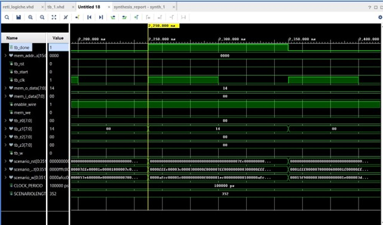
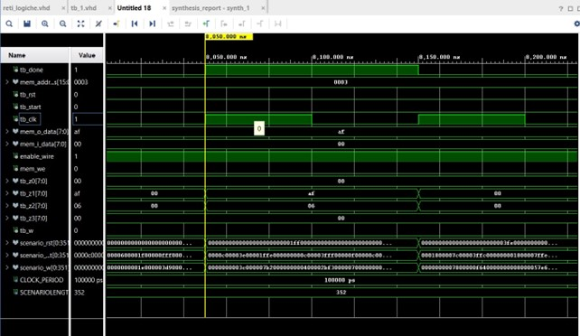

Prova Finale di reti Logiche

Alberto Leo

Matricola: 890177

# INTRODUZIONE 

Il sistema implementato ha il compito di leggere dal nastro i_w in input
dei valori che secondo la specifica andranno ad indicare il nastro d
uscita(primi due bit di i_w) su cui scrivere il dato in memoria e l
indirizzo di memoria (successivi bit fino ad un max di 16) dove è
contenuto il dato, inoltre il segnale i_start è il segnale che regola la
lettura su i_w, ne leggiamo i valori solo quando è alto, un altro
segnale che invece regola la scrittura è o_done noi vedremo i dati nei
canali d uscita solo quando o_done è alto, se è basso le uscite saranno
a zero, il tutto rispettando un segnale di reset che quando ricevuto
reinializza il modulo.

# ARCHITETTURA 

Per sviluppare tale sistema ho deciso di sviluppare una architettura a
stati che mi permettesse di gestire la memorizzazione del canale d
uscita in header1 e anche la lettura dell indirizzo di memoria da cui
prendere il dato che è succesivo alla lettura dei due bit del canale d
uscita quindi andando in READ_ADDR inizio la lettura dell indirizzo
successivamente prima di passare alla scritturavado in waiting un altro
stato che mi permettendo di aggiornare la l inidrizzo di memoria ed
infine in WRITE_DATA scrivo sulle uscite, tutto ciò rispettando i vari
segnali e loro funzioni così da specifica.

INTERFACCIA COMPONENTE

<table>
<colgroup>
<col style="width: 100%" />
</colgroup>
<thead>
<tr class="header">
<th>
entity project_reti_logiche is
port (
    i_clk : in std_logic;
    i_rst : in std_logic;
    i_start : in std_logic;
    i_w : in std_logic;

<blockquote>

o_z0 : out std_logic_vector(7 downto 0);
o_z1 : out std_logic_vector(7 downto 0);
o_z2 : out std_logic_vector(7 downto 0);
o_z3 : out std_logic_vector(7 downto 0);
o_done : out std_logic;

o_mem_addr : out std_logic_vector(15 downto 0);
i_mem_data : in std_logic_vector(7 downto 0);
o_mem_we : out std_logic;
o_mem_en : out std_logic

);

</blockquote>

end project_reti_logiche;
</th>
</tr>
</thead>
<tbody>
</tbody>
</table>

In particolare:

- i_clk è il segnale di CLOCK in ingresso generato dal Test Bench;

- i_rst è il segnale di RESET che inizializza la macchina pronta per
  ricevere il primo segnale di START;

- i_start è il segnale di START generato dal Test Bench;

- i_w è il segnale W precedentemente descritto e generato dal Test
  Bench;

- o_z0, o_z1, o_z2, o_z3 sono i quattro canali di uscita;

- o_done è il segnale di uscita che comunica la fine dell’elaborazione;

- o_mem_addr è il segnale (vettore) di uscita che manda l’indirizzo alla
  memoria;

- i_mem_data è il segnale (vettore) che arriva dalla memoria in seguito
  ad una richiesta di lettura;

- o_mem_en è il segnale di ENABLE da dover mandare alla memoria per
  poter comunicare (sia in lettura che in scrittura);

- o_mem_we è il segnale di WRITE ENABLE da dover mandare alla memoria
  (=1) per poter scriverci. Per leggere da memoria esso deve essere 0.

RISULTATI SPERIMENTALI:

SYNTHESIS_REPORT:

> 

SYNTH_DESIGN:

POWER-ANALYSIS:

> TESTBENCH:

Come si vede nella seguente parte del test bench legge dall indirizzo di
memoria 00000000 il dato equivalente che in esadecimale è 14
corrispondente a 20 in decimale, come specificato nel SIGNAL RAM ( 0 =\>
STD_LOGIC_VECTOR(to_unsigned(20, 8)) ) lo scrive come da scenario nell
uscita z1 e scrive solo quando il segnale o_done è alto, e quando torna
basso rimette le uscite a zero, rendendo così visibili i valori solo
quando o_done =1:

Andando avanti nello scenario: possiamo vedere il caso in cui legge in
0bf3 il dato ‘06’ e lo mette nell uscita z1,questa volta quando o_done
altosi vedrà ancheil precedente valore in z0 così come specifica ,allego
anche una foto in cui faccio vedere il contenuto di address(), così da
poter verificare l uscita (01) e l indirizzo bf3(101111110011) come da
scenario :

Metto anche il successivo caso nello scenario dove leggo in 0003 il dato
af (in esadecimale) che corrisponde a 175 in decimale ,così come
specificato nel testbench :

(3 =\> STD_LOGIC_VECTOR(to_unsigned(175, 8)))

COMMENTI e CONCLUSIONI:

Progettando in Xilinx Vivado un architettura ,simulabile sia pre che
post-sintesi, che si ritiene abbia messo nella giusta uscita, i dati
letti nell indirizzo ricevuto in input sempre da i_w, e rispettando i
segnali e tempistiche secondo specifiche. Usare Vivado invece che altri
programmi come HDL a volte può risultare più complesso soprattutto nel
sintetizzare alcune funzioni, che di base non sono sintetizzabili come
loop o funzioni definite col ‘dowto’ e ‘to’ (vedere commenti nel codice)
ma si trova sempre una strada. Spero il progetto sia esaustivo e
coerente

Alberto Leo
